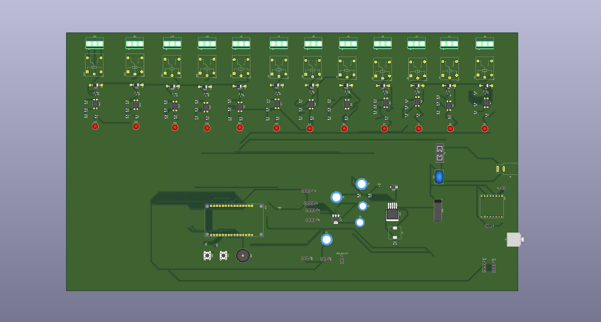
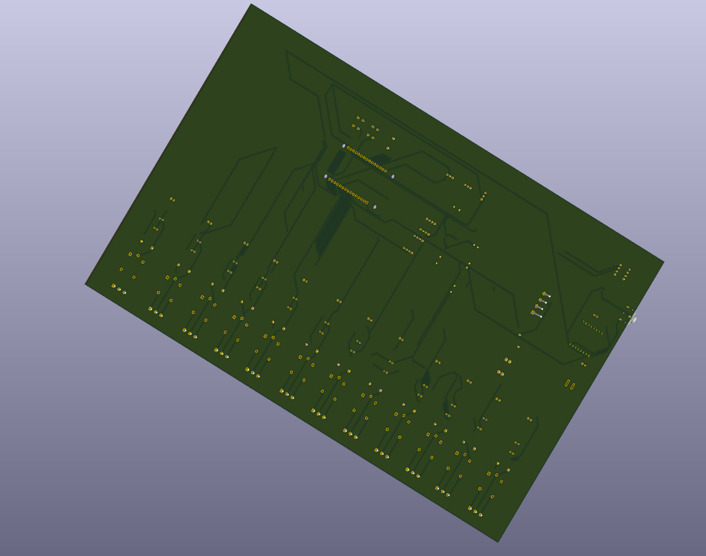

# 16-Channel Relay Control Board

## Overview

This project showcases a custom **2-layer PCB** designed in **KiCad** for a **16-channel relay control system** used in an industrial helmet cleaning application.

The PCB was developed to control multiple electrical loads through relay outputs while maintaining a compact layout, organized signal routing, and reliable power distribution. The design interfaces with a microcontroller to automate the operation of various subsystems within the helmet cleaning machine.

---

## Features

* 2-Layer PCB Design
* 16-Channel Relay Control
* Microcontroller Interface
* Relay Driver Circuitry
* Power Distribution Network
* Screw Terminal Connectors
* Compact PCB Layout
* Industrial Automation Ready

---

## Applications

* Industrial Automation
* Helmet Cleaning Systems
* Multi-Channel Load Switching
* Embedded Control Systems
* Relay-Based Automation

---

## Skills Demonstrated

* PCB Layout Design
* Component Placement
* Signal Routing
* Power Distribution
* Relay Driver Interface Design
* Embedded Hardware Design
* Design Rule Check (DRC)
* 3D PCB Visualization
* KiCad PCB Design

---

## PCB Specifications

| Parameter         | Value                       |
| ----------------- | --------------------------- |
| PCB Software      | KiCad                       |
| PCB Layers        | 2                           |
| Board Type        | Industrial Relay Controller |
| Relay Channels    | 16                          |
| Control Interface | Microcontroller             |
| Application       | Helmet Cleaning Machine     |

---

## PCB Images

### Top View

---

### Bottom View

---

---

## Design Highlights

* Designed for reliable control of 16 independent relay channels.
* Optimized component placement for simplified routing and assembly.
* Dedicated power distribution network for relay operation.
* Compact PCB layout suitable for industrial embedded systems.
* Mechanical verification using KiCad 3D models.

---

## Files Included

* README.md
* Top_View.png
* Bottom_View.png
* 3D_Front.png
* 3D_Back.png

---

## Disclaimer

This repository is intended to showcase PCB layout and hardware design skills.

Only PCB renders, mechanical models, and documentation are included. Schematics, editable PCB source files, Gerber files, BOMs, and manufacturing data are intentionally excluded where appropriate.
